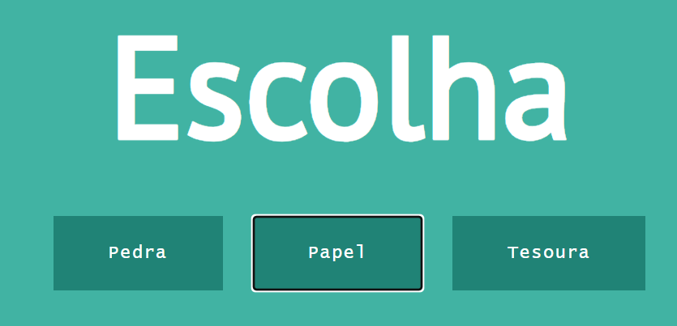

# Jokenpô com HTML CSS JS

#### Este é um jogo singlePlayer simples de Jokenpô feito com HTML, CSS e javaScript.

Este projeto consiste em recriar o jogo Jokenpô, foi solicitado como laboratorio do curso [Fundamentals of Javascript through rock-paper-scissors](https://cognitiveclass.ai/courses/course-v1:IBM+GPXX03HFEN+v1) da [Cognitiveclass.ai](https://cognitiveclass.ai/). Oferecido pela IBM

Preview:

  

O curso é gratuito e está disponível no site da [Cognitiveclass](https://cognitiveclass.ai/)